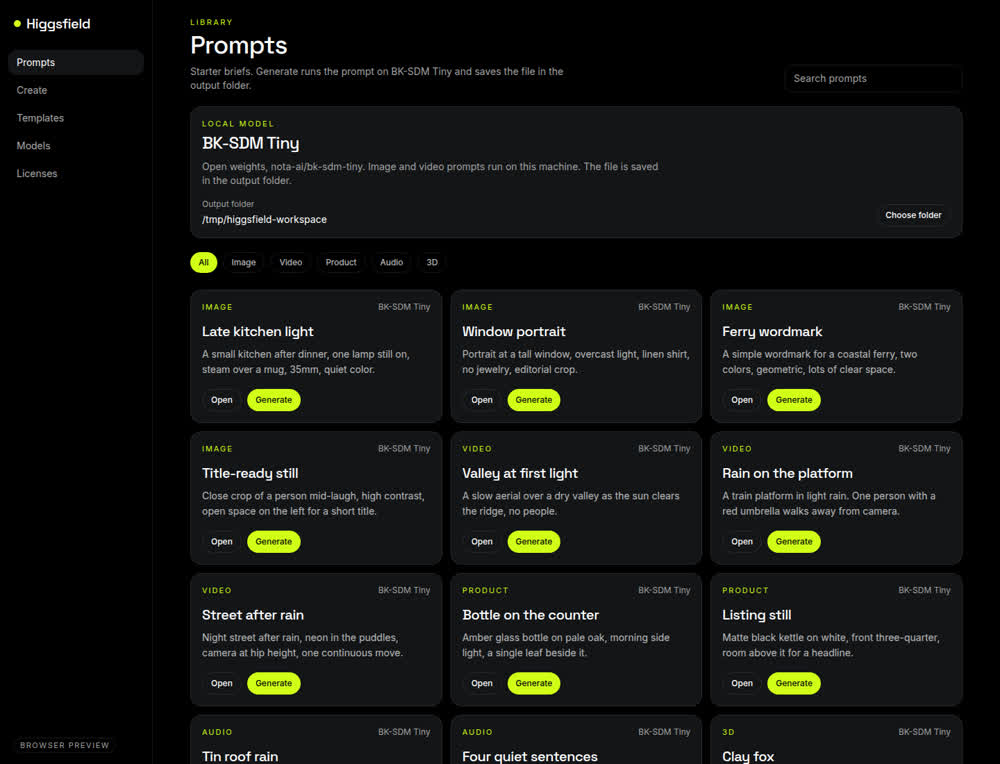
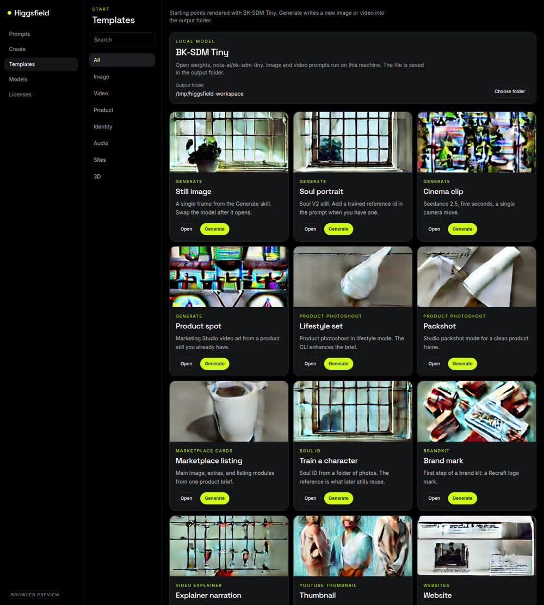
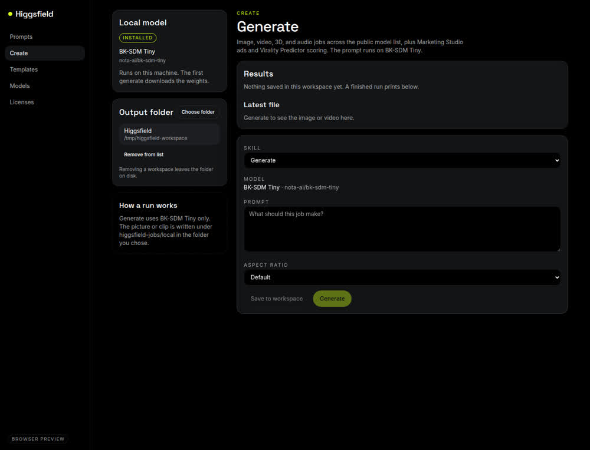

# Higgsfield for Mac

Open source Mac app for [Higgsfield](https://higgsfield.ai) prompts and templates. Image and video generation runs on this machine.

The window is a black studio with a lime accent. Prompts and templates are the library. Create runs the checkpoint you select and saves the file in a folder you pick with the system folder dialog.

Hosted Higgsfield models have no public weights. The model library names them and does not offer a download.

## Screenshots







## Local models

Generate uses the checkpoint selected in Models or Create. See [NOTICES.md](NOTICES.md).

- **Stable Diffusion 1.5** (`runwayml/stable-diffusion-v1-5`) is the stronger open checkpoint.
- **BK-SDM Tiny** (`nota-ai/bk-sdm-tiny`) is the smaller, less detailed one.
- Checkpoints already on the machine are listed too, including a ComfyUI `models/checkpoints` folder when one exists.
- Soul, Kling, Veo, Seedance, and the other hosted models have no public weights. They cannot be downloaded.
- If the selected checkpoint is installed, Generate runs it. If it is missing, Generate downloads it, shows that progress, then runs it.
- Image briefs save a PNG. Video briefs save an MP4 made of four frames, plus a poster frame.
- Files are saved in `~/Pictures/Higgsfield`. Choose folder can point somewhere else. The app never uses `/`.

Template cards ship with a demo generated from each template prompt. Those files are packed into the app next to the window.

## Install the app

The current disk image is on [GitHub Releases](https://github.com/erboland/higgsfield-mac/releases/latest):

[Higgsfield-0.1.4-arm64.dmg](https://github.com/erboland/higgsfield-mac/releases/download/v0.1.4/Higgsfield-0.1.4-arm64.dmg)

There is no Apple Developer ID. The app is ad-hoc signed, and it is not notarized. A browser attaches a quarantine flag. macOS then says “Higgsfield” is damaged, and right-click Open does not get past that dialog. The disk image also contains `Open Higgsfield.command`. macOS blocks that file (“Open Higgsfield.command” Not Opened. Apple could not verify it is free of malware), so the file never runs and never clears quarantine.

Open the disk image so the volume `Higgsfield` is mounted. The volume is read-only, so copy the app into Applications and clear the flag in Terminal. The `xattr` on your PATH is not the system command. It rejected `-r`. These commands call `/usr/bin/xattr`:

```bash
/usr/bin/ditto "/Volumes/Higgsfield/Higgsfield.app" /Applications/Higgsfield.app
/usr/bin/xattr -cr /Applications/Higgsfield.app
/usr/bin/open /Applications/Higgsfield.app
```

If `/Applications` is not writable, use `$HOME/Applications` in all three commands.

The disk image is created with `hdiutil` and checked with `hdiutil verify` before it is published. If an older download says the disk image is corrupted, or says the app is damaged, download 0.1.4 again and discard the older file.

## Develop

Install [Node.js 22](https://nodejs.org/) and Python 3.12, then:

```bash
npm install
python3 -m venv runner/.venv
runner/.venv/bin/pip install -r runner/requirements.txt
npm run dev
```

That starts the Electron window and the renderer at <http://127.0.0.1:43127>.

`npm run dev:web` serves the screens without a window. Choosing a folder uses the system dialog in the Electron window.

## Checks

```bash
npm test
npm run typecheck
```

## Build a disk image

On a Mac:

```bash
npm run dist:mac
```

`npm run dist:mac` writes `release/<version>/Higgsfield-<version>-<arch>.dmg`. electron-builder does not use a Developer ID (`identity` is null). `scripts/adhoc-sign.mjs` then ad-hoc signs the bundle, and the disk image must pass `codesign --verify --deep --strict` and `hdiutil verify`. The image also contains `Open Higgsfield.command`. macOS blocks that file before it can run, so the install steps above clear quarantine with `/usr/bin/xattr -cr` in Terminal. The app is not notarized. GitHub Actions on `macos-latest` builds the disk image for a `v*` tag, or for a `main` commit whose message contains `Release v`, and attaches the `.dmg` to the GitHub Release.

## What you can do

- Browse prompts and templates. Each template card shows a demo made with BK-SDM Tiny.
- Choose an output folder with the folder dialog.
- Generate an image or a short video on this machine. The result is shown in the window and saved in the folder.

## License

MIT. See [LICENSE](LICENSE), [NOTICES.md](NOTICES.md), [CONTRIBUTING.md](CONTRIBUTING.md), and [SECURITY.md](SECURITY.md).
